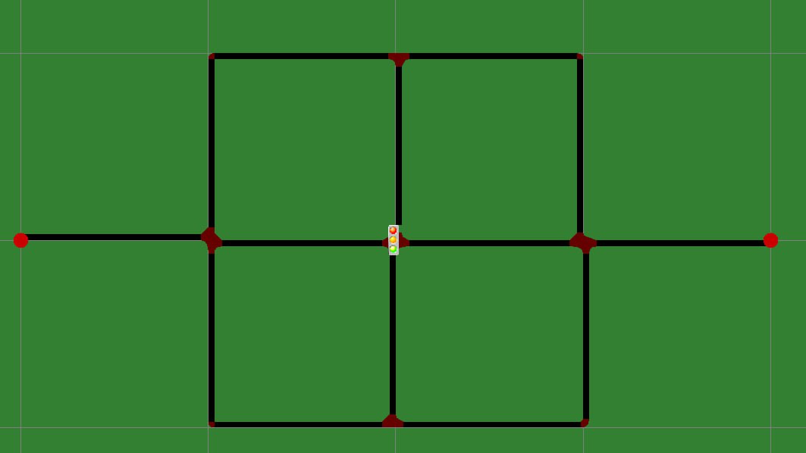
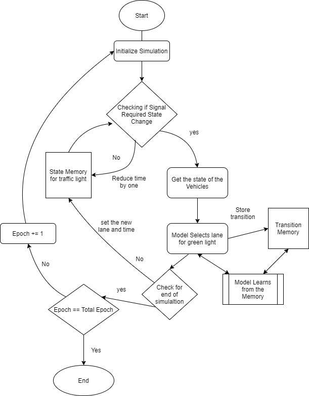
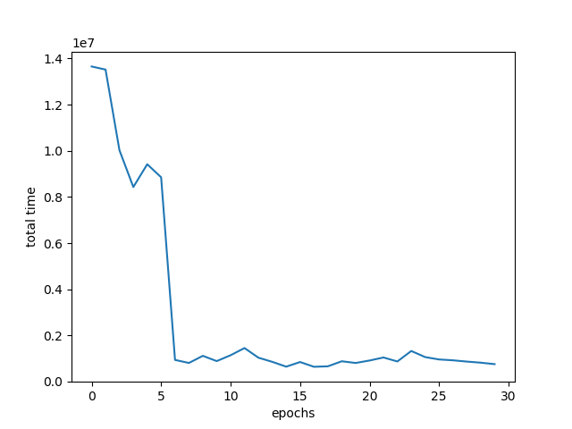
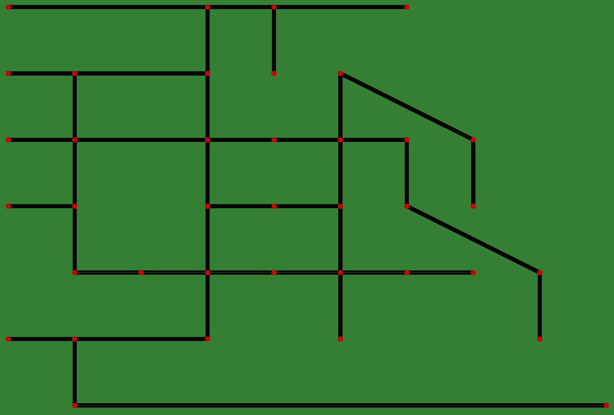

# TrafficAI: Intelligent Traffic Control System

TrafficAI utilizes the Q-learning algorithm, a form of reinforcement learning, to optimize traffic light coordination at
intersections, enhancing traffic flow and reducing vehicle wait times in urban areas.

## Table of Contents

- [Project Overview](#project-overview)
- [Key Features](#key-features)
- [How It Works](#how-it-works)
- [Training Process](#training-process)
- [Simulation Environment](#simulation-environment)
- [Results](#results)
- [Getting Started](#getting-started)
    - [Prerequisites](#prerequisites)
    - [Installation](#installation)
    - [Training a New Model](#training-a-new-model)
    - [Running a Trained Model](#running-a-trained-model)
- [Sample Maps](#sample-maps)

## Project Overview

TrafficAI creates a virtual urban environment with multiple intersections controlled by traffic signals. The system
determines the optimal signal timing for each intersection to minimize overall vehicle wait times.



## Key Features

- Reinforcement Learning-based traffic light management
- Customizable city grid layouts
- SUMO integration for realistic traffic simulations
- Performance visualization through time vs. epoch graphs

## Operational Mechanism

1. The system analyzes real-time data on vehicle presence at each intersection approach.
2. Using this information, the AI determines the most efficient signal phase for each intersection.
3. A minimum duration for each green phase is maintained to ensure smooth traffic flow.
4. The primary objective is to minimize cumulative wait times across all vehicles.

## How It Works

1. The system receives input on the number of vehicles present on all four sides of each traffic node.
2. Based on this input, the model decides which side should receive the green signal for each node.
3. A minimum green light duration is enforced to ensure traffic flow stability.
4. The system aims to minimize the total waiting time, calculated as: (number of cars) × (waiting time in seconds)



## Training Process

The model is trained on a series of "events" - predefined traffic scenarios that represent various traffic conditions.
This approach ensures consistent and comparable results across training iterations.

1. Multiple fixed events are used to train the model, allowing it to handle different situations.
2. The model receives input only on the number of vehicles present on 4 sides of each traffic node.
3. The output is the selected side for the green signal at each node.
4. The number of nodes depends on the size of the grid.

## Simulation Environment

TrafficAI uses SUMO (Simulation of Urban MObility), an open-source traffic simulation package, to create realistic city
maps and generate traffic simulations for training the model.

## Results

The project includes performance graphs that show the relationship between training epochs and total traffic time for
different city layouts:

### Epoch vs Time for Map 1



[//]: # (### Epoch vs Time for Map 2)

[//]: # (![Epoch vs Time for Map2]&#40;plots/time_vs_epoch_city3.png&#41;)

[//]: # ()

[//]: # (### Epoch vs Time for Map 3)

[//]: # (![Epoch vs Time for Map3]&#40;plots/time_vs_epoch_model.png&#41;)

## Getting Started

### Prerequisites

- Python 3.8+
- SUMO GUI

Tested on Ubuntu 24.04 LTS with Python 3.12.4 and SUMO 1.18.0.

### Installation

1. Clone the repository:
   ```
   git clone https://github.com/Aral-Tech/Traffic-ai.git
   cd Traffic-ai
   ```

2. Create a virtual environment:
   ```
   python -m venv venv
   source venv/bin/activate
   ```

3. Install the required packages:
   ```
   pip install -r requirements.txt
   ```

4. Download and install [SUMO GUI](https://sumo.dlr.de/docs/Downloads.php)

### Training a New Model

1. Create a network file using SUMO's netedit tool (e.g., `network.net.xml`) and save it in the `maps` folder.

2. Generate a route file:
   ```
   cd maps
   python randomTrips.py -n network.net.xml -r routes.rou.xml -e 500
   ```
    - `-n network.net.xml`: Specifies the network file
    - `-r routes.rou.xml`: Specifies the route file
    - `-e 500`: Generates 500 random trips

3. Update the configuration file (`configuration.sumocfg`) with your network and route files:
   ```xml
   <input>
     <net-file value='maps/network.net.xml'/>
     <route-files value='maps/routes.rou.xml'/>
   </input>
   ```

4. Train the model:
   ```
   python train.py --train -e 50 -m model_name -s 500
   ```
    - `-e 50`: Sets the number of epochs to 50
    - `-m model_name`: Specifies the name of the model to be saved in the model folder
    - `-s 500`: Tells the simulation to run for 500 steps
    - `--train`: Indicates that the script should train a new model

After training, time vs. epoch graphs will be generated and saved in the `plots` folder.

### Running a Trained Model

To run a pre-trained model on the SUMO GUI:

```
python train.py -m model_name -s 500
```

- `-m model_name`: Specifies the name of the model to be loaded from the model folder
- `-s 500`: Tells the simulation to run for 500 steps

This command will open the SUMO GUI, allowing you to visualize how your trained model performs.

## Sample Maps

TrafficAI includes several sample maps used for training and testing:

### Map 1



[//]: # (### Map 2)

[//]: # (![Map 2]&#40;maps_images/city3.JPG&#41;)

[//]: # ()

[//]: # (### Map 3)

[//]: # (![Map 3]&#40;maps_images/citymap.JPG&#41;)

---

For more detailed information, please refer to the project documentation or contact the development team.

## Open Source Resources

Our project builds upon and integrates several open-source tools and research. We acknowledge and appreciate the
following resources:

### SUMO randomTrips.py

We utilize the `randomTrips.py` script from the SUMO (Simulation of Urban MObility) project to generate random trips for
our simulations. This script is an essential tool for creating realistic traffic patterns in our virtual environment.

- Source: [randomTrips.py on GitHub](https://github.com/eclipse-sumo/sumo/blob/main/tools/randomTrips.py)
- Usage in our project:
  ```
  python randomTrips.py -n network.net.xml -r routes.rou.xml -e 500
  ```
  This command generates a route file (`routes.rou.xml`) for 500 simulation steps based on the given network file (
  `network.net.xml`).

### AI Traffic Lights Controller Research

Our multi-intersection traffic light control system is inspired by and builds upon the research conducted by Yossi
Doctor. We've adapted the single-intersection model presented in this work to function across multiple intersections
within the SUMO environment.

- Original Research: [AI Traffic Lights Controller](https://github.com/yossidoctor/AI-Traffic-Lights-Controller)
- Key Adaptations:
    1. Extended the reinforcement learning model to handle multiple intersections simultaneously.
    2. Integrated the model with SUMO for more complex and realistic city-scale simulations.
    3. Modified the reward function to account for global traffic optimization across all managed intersections.

We encourage interested parties to review the original research for a deeper understanding of the foundational concepts
employed in our project.

## Acknowledgments

We would like to express our gratitude to the [SUMO development team](https://eclipse.dev/sumo/) development team
and [Yossi Doctor](https://www.linkedin.com/in/yossi-doctor) for their valuable open-source contributions, which have
been instrumental in the development of TrafficAI.

---

TrafficAI - Intelligent Traffic Control System

### Website link: [TrafficAi](https://traffic-ai.netlify.app)

### Team Members

- [Diyarbek Oralbaev](https://linkedin.com/in/diyarbek-oralbaev) - *Backend Developer && DevOps Engineer && ML Engineer*
- [Mirjalol Shavkatov](https://linkedin.com/in/mirjalol-shavkatov) - *Project Manager && ML Engineer*
- [Salimbay Elmuratov](https://linkedin.com/in/salimbay-elmuratov) - *Frontend Developer && ML Engineer*

## Thank you for your interest in TrafficAI! 🚦🚗
